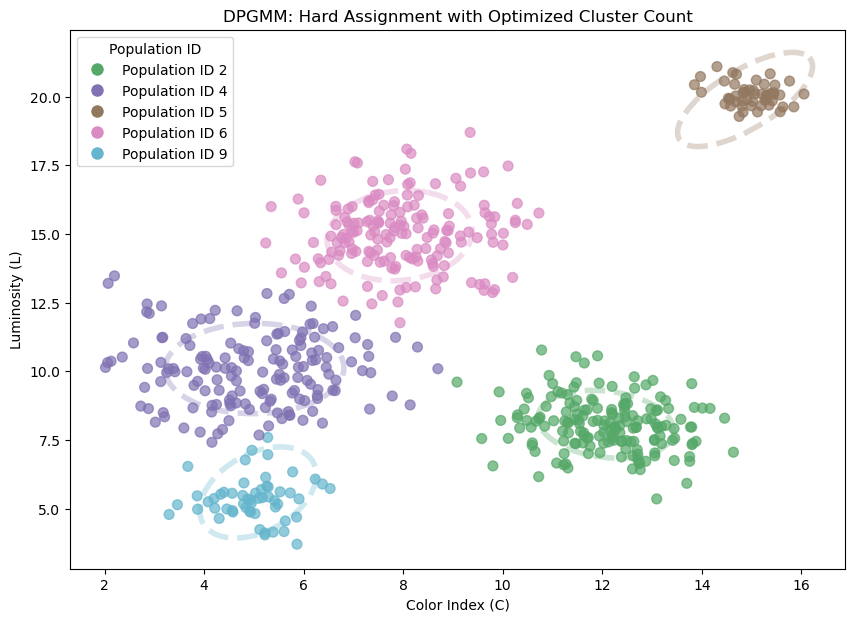
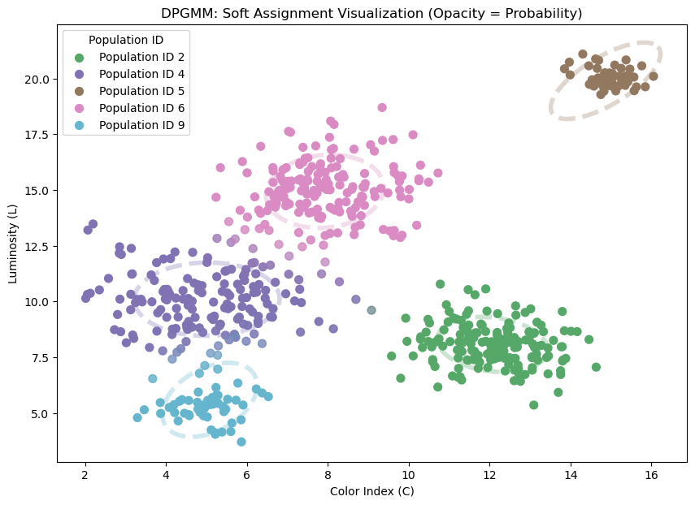
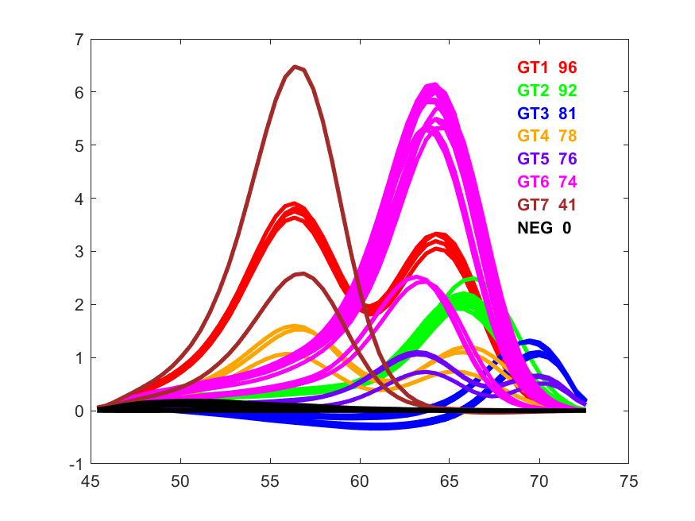

## Dirichlet Process Mixture Model (DPMM)

The **Dirichlet Process Mixture Model (DPMM)** is a powerful, non-parametric Bayesian method used for **clustering** or **density estimation** that significantly improves upon the standard Gaussian Mixture Model (GMM). It employs a **Dirichlet Process (DP)** prior, which allows the model to automatically and adaptively determine the optimal number of clusters (or components) in the data.

---

### Key Concepts

The main distinction of the DPMM is that it treats the number of clusters, $K$, as an unknown variable to be inferred from the data, rather than requiring the user to specify it beforehand.

| Feature | Dirichlet Process Mixture Model (DPMM) | Standard Gaussian Mixture Model (GMM) |
| :--- | :--- | :--- |
| **Number of Clusters ($K$)** | **Non-parametric:** Automatically inferred from the data. $K$ is potentially infinite (though finite in practice). | **Parametric:** Must be specified in advance by the user. |
| **Prior** | Dirichlet Process (DP) on component weights. | Typically a conjugate prior (e.g., Normal-Wishart) on fixed $K$ components. |
| **Goal** | Density estimation, Clustering, **Model Selection** (finding $K$). | Density estimation, Clustering. |

---

### The Dirichlet Process Prior

The **Dirichlet Process** acts as a prior distribution over an infinite number of possible components. It can be intuitively understood using the **Chinese Restaurant Process (CRP)** analogy:

Imagine a restaurant where customers (data points) arrive sequentially and choose a table (cluster):
* **The first customer** sits at the first empty table.
* **Subsequent customers** can either:
    1.  Sit at an **already occupied table** with a probability proportional to the number of people already there. (This means assigning the data point to an **existing cluster**.)
    2.  Sit at a **new, empty table** with a probability proportional to a **concentration parameter** ($\alpha$). (This corresponds to creating a **new cluster**.)

The parameter $\alpha$ governs the model's tendency to create new clusters; a larger $\alpha$ encourages more clusters, while a smaller $\alpha$ favors fewer, larger clusters.

---

### Application and Advantages

A DPMM is essentially a **Bayesian Gaussian Mixture Model (BGMM)** that utilizes the Dirichlet Process prior on the component weights.

#### Advantages of DPMM:

1.  **Automatic Model Selection:** It eliminates the time-consuming process of manually selecting the cluster count $K$ (or using expensive methods like AIC/BIC), which is its primary strength.
2.  **Robustness:** The model is less sensitive to initial component estimates since it can dynamically merge or discard components during training.
3.  **Parsimony:** Given sufficient data, the DPMM naturally favors simpler models (fewer clusters) over overly complex ones due to the properties of the DP.

## Example of Hard Assignment

## Example of Soft Assignment

## Example Melting Curve Clustering

